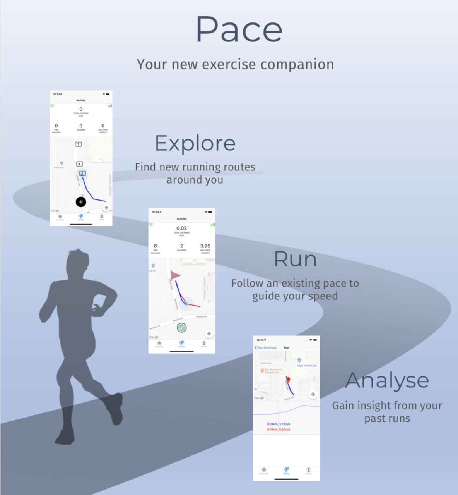

# Pace

Pace is an iOS fitness application which lets users record running routes and share them with friends.

This is a project for [CS3217 (Software Engineering on Modern Application Platforms)](https://www.facebook.com/cs3217/) at the [School of Computing](https://www.comp.nus.edu.sg), [National University of Singapore](http://www.nus.edu.sg).

## Features

### Run recording and route creation

A user can choose to create a new route. When he does so, location and timing are recorded repeatedly at a small time interval when he starts a run. This is used to produce a new running route and a new pace.  

### Pace matching

A user can choose to follow a route and pace with one of the recorded paces. When he does so, every time point he reaches a point in the route, his time would be recorded and matches against the time in
the pace. In this case, the application would periodically inform the user through an audio notification whether he is ahead or behind the pace, and by how much.  

### Pace & Route publishing

A user can choose to publish his runs publicly right after he finished his run. If the user’s run creates a new route, it would be posted with his pace so that other users who choose this route can follow the same route. Otherwise, a new pace will be added to the followed route.  

### Run analysis on one or more runs   

After a run, a user can either choose to see its analysis on its own or in comparison with another pace. This pace can be one of the user’s past paces, or from other users. When a user runs an analysis, he would be able to see the locations of both runners at every point in time. Only the fastest time by a user will be used as the comparison.  

### Save favourite routes

User can browse public routes and save the route as a favourite route for easy retrieval in the future.

### Track user statistics

User can access their overall run statistics from using the app to track their exercise regime.

## Built With

- [Swift 4.2](https://swift.org/) - The programming language used
- [XCode 10.1](https://developer.apple.com/xcode/) - The development environment used
- [Realm](https://realm.io/) - Local storage
- [Firebase](https://firebase.google.com/) - Cloud storage

## Authors

- [Ang Wei Neng](https://github.com/wn)
- [Julius Sander](https://github.com/juxd)
- [Tan Zheng Wei](https://github.com/zhengwei143)
- [Zhang Yuntong](https://github.com/yuntongzhang)
